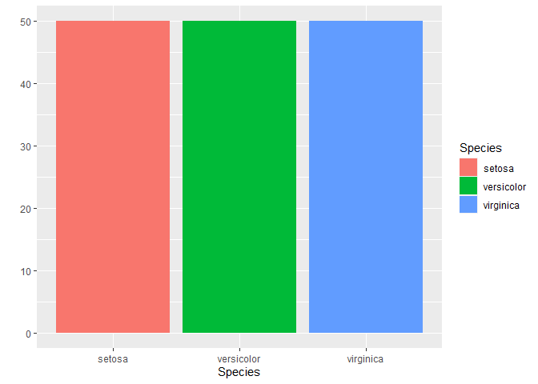
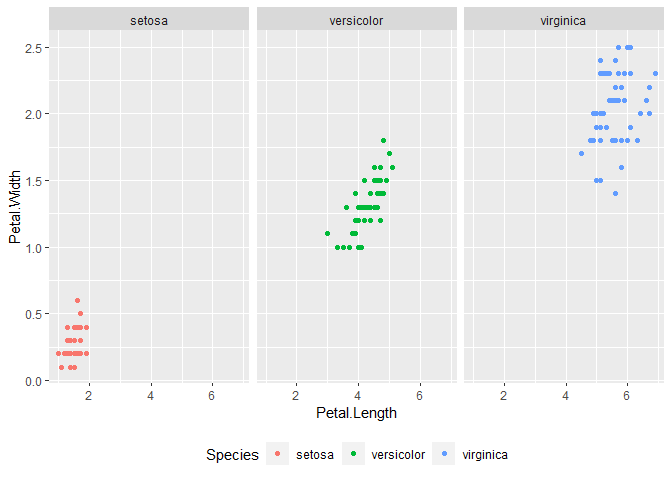
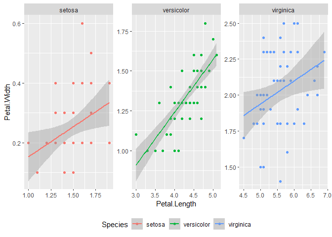
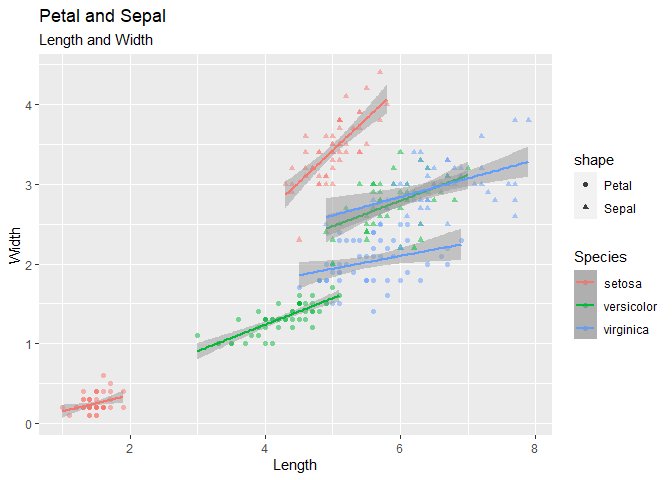
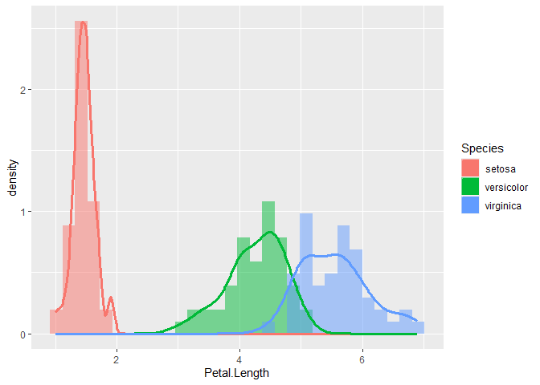
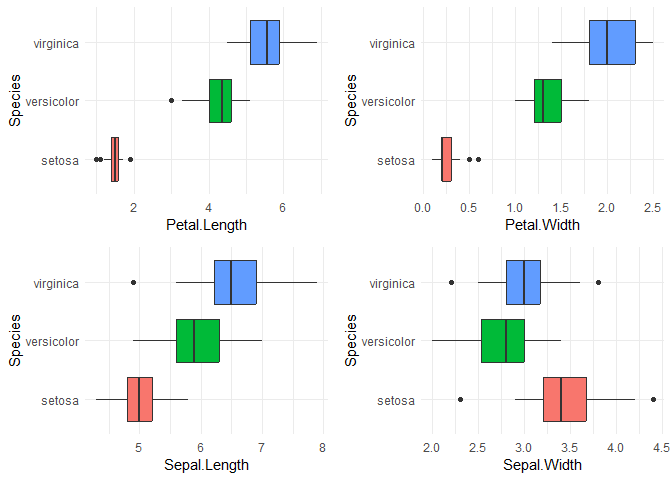
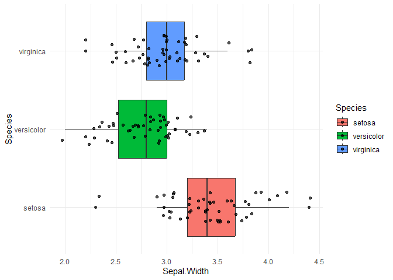

iris-dataset-analysis
================
Adrian M
2023-10-14

# Introduction

Edgar Anderson’s Iris Data

This famous (Fisher’s or Anderson’s) iris data set gives the
measurements in centimeters of the variables sepal length and width and
petal length and width, respectively, for 50 flowers from each of 3
species of iris. The species are Iris setosa, versicolor, and virginica.

Setting up the environment

?iris

``` r
# install.packages("tidyverse")
# install.packages("ggplot2")
library(tidyverse)
```

    ## Warning: package 'tidyverse' was built under R version 4.3.1

    ## Warning: package 'tidyr' was built under R version 4.3.1

    ## Warning: package 'purrr' was built under R version 4.3.1

    ## Warning: package 'dplyr' was built under R version 4.3.1

    ## Warning: package 'forcats' was built under R version 4.3.1

    ## Warning: package 'lubridate' was built under R version 4.3.1

    ## ── Attaching core tidyverse packages ──────────────────────── tidyverse 2.0.0 ──
    ## ✔ dplyr     1.1.3     ✔ readr     2.1.4
    ## ✔ forcats   1.0.0     ✔ stringr   1.5.0
    ## ✔ ggplot2   3.4.4     ✔ tibble    3.2.1
    ## ✔ lubridate 1.9.3     ✔ tidyr     1.3.0
    ## ✔ purrr     1.0.2     
    ## ── Conflicts ────────────────────────────────────────── tidyverse_conflicts() ──
    ## ✖ dplyr::filter() masks stats::filter()
    ## ✖ dplyr::lag()    masks stats::lag()
    ## ℹ Use the conflicted package (<http://conflicted.r-lib.org/>) to force all conflicts to become errors

``` r
library(ggplot2)
```

Copying iris data set to variable ‘df’

``` r
df <- iris
```

A quick view of the dataset

``` r
head(df)
```

    ##   Sepal.Length Sepal.Width Petal.Length Petal.Width Species
    ## 1          5.1         3.5          1.4         0.2  setosa
    ## 2          4.9         3.0          1.4         0.2  setosa
    ## 3          4.7         3.2          1.3         0.2  setosa
    ## 4          4.6         3.1          1.5         0.2  setosa
    ## 5          5.0         3.6          1.4         0.2  setosa
    ## 6          5.4         3.9          1.7         0.4  setosa

Trying some univariate analysis and visualize this using `qplot`

?qplot

Using `qplot` to show a plot. Check the number of records per Species

``` r
qplot(Species, 
      fill = Species, #to identify the color per species
      data = df)
```

    ## Warning: `qplot()` was deprecated in ggplot2 3.4.0.
    ## This warning is displayed once every 8 hours.
    ## Call `lifecycle::last_lifecycle_warnings()` to see where this warning was
    ## generated.

<!-- -->

`qplot` automatically decides which plot to use based on supplied
variables. 50 records per species as the data set introduction
described.

Trying `qplot` to show a scatterplot

``` r
qplot(Petal.Length, 
      Petal.Width, 
      data = df)
```

<!-- -->

Adding some colors by Species

``` r
qplot(Petal.Length, 
      Petal.Width, 
      color = Species,
      data = df)
```

<!-- -->

Looks good but documentation says `qplot` is deprecated (no longer
useful or better options exist) In this case, I’m going to try and
explore ggplot instead

?ggplot

``` r
#add the base layer
ggplot(data = df, 
       mapping = aes(x = Petal.Length, 
                     y = Petal.Width))
```

<!-- -->
It’s blank. Of course since the only the `aes()` or the aesthetic is
present here. I need to add more layers and specify which type of plot
to use.

``` r
ggplot(data = df, 
       mapping = aes(x = Petal.Length, 
                     y = Petal.Width)) +
  geom_point() #scatterplot layer
```

<!-- -->

`ggplot` allows for better control over what you want to display versus
`qplot`.

Also, it says we can drop the specifications for the `data=` and
`mapping=` arguments as long as we supply the correct arguments in the
correct order. Nice.

Adding some colors

``` r
ggplot(df,
       aes(x = Petal.Length,
           y = Petal.Width,
           col = Species)) + #color that helps identify by species
  geom_point()
```

<!-- -->
Adding a trend line since it’s a scatterplot, to see the correlation
better.

``` r
ggplot(df, 
       aes(x = Petal.Length,
           y = Petal.Width,
           col = Species)) +
  geom_point() + 
  geom_smooth(method = lm) #add the trend line layer
```

    ## `geom_smooth()` using formula = 'y ~ x'

<!-- -->
All three species appears to have a positive correlation for Petal
length & width shown by the trend line going upwards.

I can drop the `x=` and `y=` specifications too for the `aes()` method!

?aes()

Also, ggplot uses layers so it can overlap multiple plots, from one
dataset, or more! I’ll move the `aes()` inside the `geom_point` layer
which indicates that the data points will onlky be affected by the
parameters we add in this `geom_point` layer and try some parameters

``` r
ggplot(df) +
  geom_point(aes(Petal.Length,
                 Petal.Width,
                 col = Species, #color by species 
                 shape = Species, #shape by species
                 size = 3, #size of datapoints
                 stroke = 1, #thickness of borders of datapoints, specific to geom_point
                 alpha = 0.7)) #transparency/opacity     
```

<!-- -->
Using facet to separate

?facet_wrap

``` r
ggplot(df,
       aes(Petal.Length,
           Petal.Width,
           col = Species)) +
  geom_point() +
  facet_wrap(Species ~.) + #separates by Species into own grids/plots
  theme(legend.position = "bottom") #move the legend in the bottom
```

<!-- -->
There is so much unused space in the plots so I will try to scale each
plot to fit the datapoints inside the plot and see what it looks like.

``` r
ggplot(df,
       aes(Petal.Length,
           Petal.Width,
           col = Species)) +
  geom_point() +
  facet_wrap(Species ~ .,
             scales = "free") + #this will scale down the x and y values to fit the datapoints in the plot
  geom_smooth(method = lm) +
  theme(legend.position = "bottom")
```

    ## `geom_smooth()` using formula = 'y ~ x'

<!-- -->
It looks zoomed-in and clearer but I think the trade-off here is that,
it will be harder to make quick comparisons since you will constantly
need to look at the values in the x and y axes to interpret the data
correctly.

Next, I will try to overlap two layers, length and width measurements of
petal and sepal

``` r
ggplot(df) +
  geom_point(aes(Petal.Length,
             Petal.Width,
             col = Species)) +
  geom_point(aes(Sepal.Length,
             Sepal.Width,
             col = Species)) +
#I need to change the x and y labels since we are dealing now with 2 different variables (Petal and Sepal)
  labs(title = "Petal and Sepal",
       subtitle = "Length and Width",
       x = "Length", 
       y = "Width")
```

<!-- -->
I can’t distinguish which is which. Maybe try to change the color per
variable

colors()

``` r
ggplot(df, aes(col = Species)) +
  geom_point(aes(Petal.Length,
                 Petal.Width,
                 shape = "Petal"),
             alpha = 0.5) +
  geom_smooth(aes(Petal.Length,
                  Petal.Width), 
              method = lm,
              alpha = 0.5) +
  geom_point(aes(Sepal.Length,
                 Sepal.Width,
                 shape = "Sepal"),
             alpha = 0.5) +
  geom_smooth(aes(Sepal.Length,
                  Sepal.Width),
              method = lm,
              alpha = 0.5) +
  labs(title = "Petal and Sepal",
       subtitle = "Length and Width",
       x = "Length", 
       y = "Width")
```

    ## `geom_smooth()` using formula = 'y ~ x'
    ## `geom_smooth()` using formula = 'y ~ x'

<!-- -->
This looks a little too busy but it appears that there is a positive
correlation.

I can move forward and explore ggplot further.

Try to see some relation between the measurements (petal, sepal, length
and width) but this time, show the plots side by side using cowplot
package

install.packages(“cowplot”)

``` r
library(cowplot)
```

    ## Warning: package 'cowplot' was built under R version 4.3.1

    ## 
    ## Attaching package: 'cowplot'

    ## The following object is masked from 'package:lubridate':
    ## 
    ##     stamp

``` r
gg1 <- ggplot(df, aes(col = Species)) +
  geom_point(aes(Petal.Length,
                 Petal.Width), 
             size = 2, 
             alpha = 0.7,
             show.legend = FALSE) +
  geom_smooth(aes(Petal.Length,
                  Petal.Width),
              method = lm)

gg2 <- ggplot(df, aes(col = Species)) +
  geom_point(aes(Sepal.Length,
                 Sepal.Width), 
             size = 2, 
             alpha = 0.7) +
  geom_smooth(aes(Sepal.Length,
                  Sepal.Width),
              method = lm) +
  theme(legend.position = "top",
        legend.title = element_blank())

plot_grid(gg1, gg2, ncol = 2) #from cowplot
```

    ## `geom_smooth()` using formula = 'y ~ x'
    ## `geom_smooth()` using formula = 'y ~ x'

<!-- -->
Looks better and clearer compared to overlapped data.

I can see here that Petal Length & Width have strong positive
correlation while Sepal length & width have strong positive correlation
only with setosa and somewhat positive correlation for the versicolor
and virginica.

OK I’m going to try histogram plots. Some basic plots to see the
distribution of all the measurements

``` r
#I made a function since this will repeat 4 times (petal & sepal, width & length)
create_histogram <- function(data, column_name, num_bins = 25) #create the function along with the accepted parameters
  ggplot(data) +
  geom_histogram(aes_string(column_name), 
                 bins = num_bins,
                 alpha = 0.7) + #flexibility in number of histogram bins
  theme_minimal() #makes all plots consistent
```

``` r
#Running the function, supplying the appropriate parameters, then storing each plot to a corresponding variable
hist_petal_length <- create_histogram(df, "Petal.Length")
```

    ## Warning: `aes_string()` was deprecated in ggplot2 3.0.0.
    ## ℹ Please use tidy evaluation idioms with `aes()`.
    ## ℹ See also `vignette("ggplot2-in-packages")` for more information.
    ## This warning is displayed once every 8 hours.
    ## Call `lifecycle::last_lifecycle_warnings()` to see where this warning was
    ## generated.

``` r
hist_petal_width <- create_histogram(df, "Petal.Width")
hist_sepal_length <- create_histogram(df, "Sepal.Length")
hist_sepal_width <- create_histogram(df, "Sepal.Width")

#Now plot the 4 in a 2x2 grid using plot_grid from cowplot
plot_grid(hist_petal_length, 
          hist_petal_width, 
          hist_sepal_length, 
          hist_sepal_width, 
          ncol = 2, 
          nrow = 2)
```

<!-- -->
The petal length & width appears to have a gap in a certain section of
the distribution. The group on the left could be the setosa, similar to
the gaps on the previous scatterplots. The sepal length is spread across
the measurements but the width looks to have a central tendency towards
“3”

I’ll take a closer look at petals using overlapping density plot

``` r
ggplot(df) +
  geom_histogram(aes(x = Petal.Length,
                   y = after_stat(density),
                   fill = Species),
               bins = 30,
               alpha = 0.5,
               position = "identity") + 
  geom_density(aes(x = Petal.Length, 
                   col = Species),
               size = 1.2)
```

    ## Warning: Using `size` aesthetic for lines was deprecated in ggplot2 3.4.0.
    ## ℹ Please use `linewidth` instead.
    ## This warning is displayed once every 8 hours.
    ## Call `lifecycle::last_lifecycle_warnings()` to see where this warning was
    ## generated.

<!-- -->
Identifying the species by colors confirms that the gap is because of
the iris specie setosa

Can we try using box plots to explore this dataset more?

?geom_boxplot

``` r
#make another function for the boxplot
create_boxplot <- function(data, column_name, fillBy = "Species")
  ggplot(data,
       aes_string(x = fillBy,     
           y = column_name, 
           fill = fillBy)) + 
  geom_boxplot() + 
  theme_minimal() +
  theme(legend.position = "none") +
  coord_flip() #swap the axes to make the display horizontal

gg_boxp_petalL <- create_boxplot(df, "Petal.Length")
gg_boxp_petalW <- create_boxplot(df, "Petal.Width")
gg_boxp_SepalL <- create_boxplot(df, "Sepal.Length")
gg_boxp_SepalW <- create_boxplot(df, "Sepal.Width")

plot_grid(gg_boxp_petalL,
          gg_boxp_petalW,
          gg_boxp_SepalL,
          gg_boxp_SepalW,
          ncol = 2,
          nrow = 2)
```

<!-- -->
It looks normally distributed but there are possible outliers. Taking at
closer look at Sepal width

``` r
ggplot(df,
       aes(
         x = Species,
         y = Sepal.Width,
         fill = Species)) +
  geom_boxplot() +
  geom_jitter(position = position_jitter(width = 0.2),
              alpha = 0.7) +
  theme_minimal() +
  coord_flip()
```

<!-- -->
Some data points are clearly outside lines extending outwards the box
but I cannot conclude that these are erroneous data. Since I cannot
gather more information about these “outlier” measurements for this
dataset, I will assume they are correct data for now and for the rest of
the box plots.
